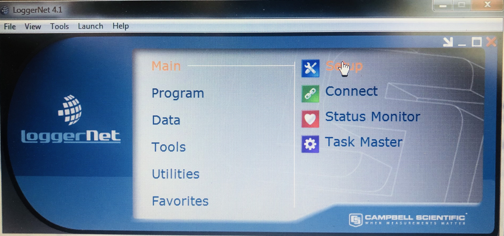
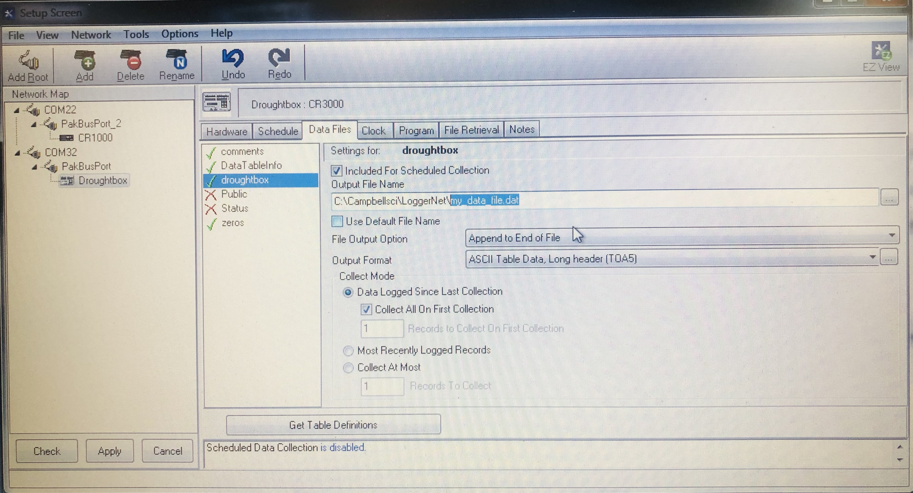

## Connect to the Droughtbox

+ Open LoggerNet v4.1

+ __Initial connect:__ Go to Main --> Connect

	 

+ __Connect to the Droughtbox:__ Select the Droughtbox and press connect  

	

+ __Create data file__: Press setup page 
 

+ __Create a new file__: Select Droughtbox at C  -->

## List of abbreviations 