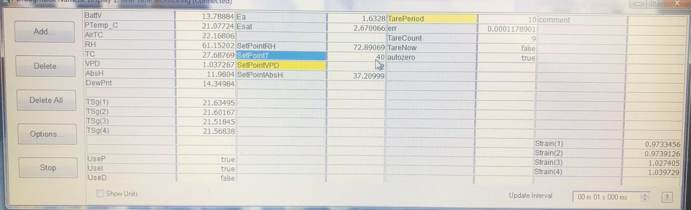

## Connect to the Droughtbox

+ Open LoggerNet v4.1

+ __Initial connect:__ Go to Main --> Connect

	 

+ __Connect to the Droughtbox:__ Select the Droughtbox and press connect  

	

## Create data file

+ __Create data file__: Press the setup bottom  
 

+ __Create a new file__: Select Droughtbox at COM32  --> Go to the Data File tab --> Select droughtbox --> change the name of the file following the format `YYYY_MM_DATE_OWNER.dat` for example `2023_08_10_erick.dat`

	If you don't change the file path your file will be stored at `C:\Campbellsci\LoggerNet` 

	If 

## Open numeric display

 + __Open Numeric Display__: Press Num Display bottom
 

+ Window should appear 

### List of abbreviations 
