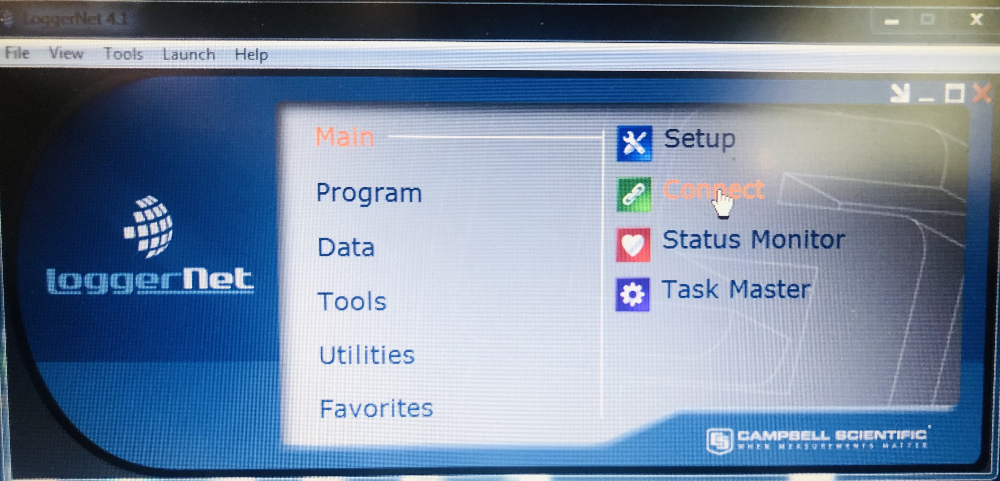
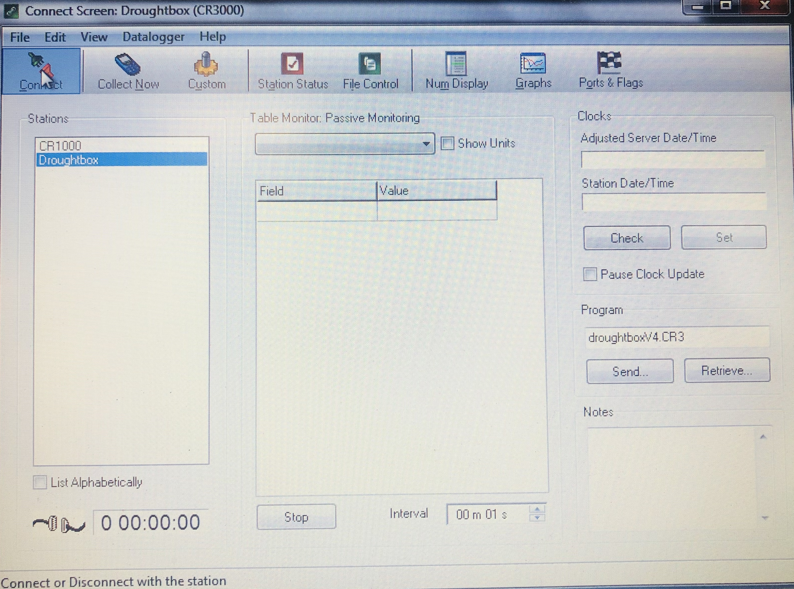
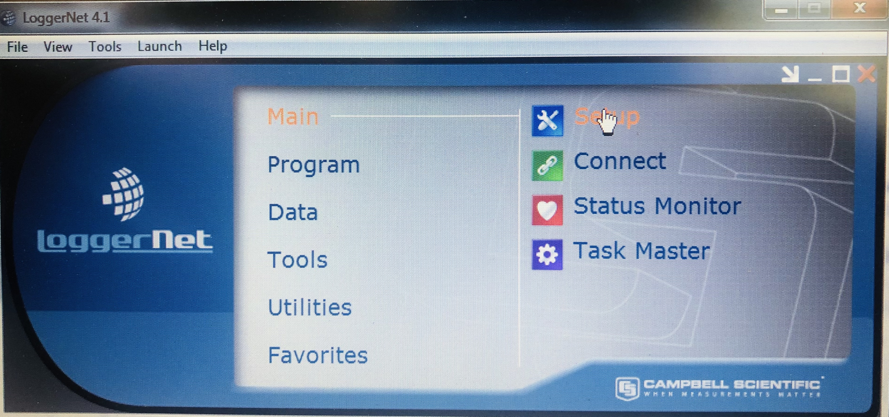
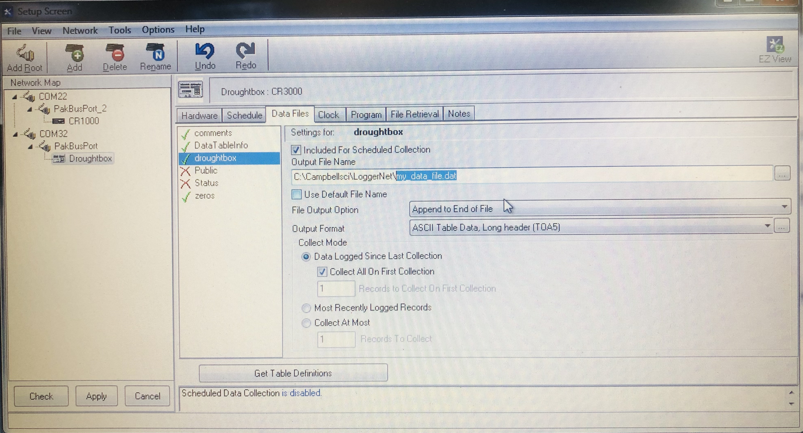
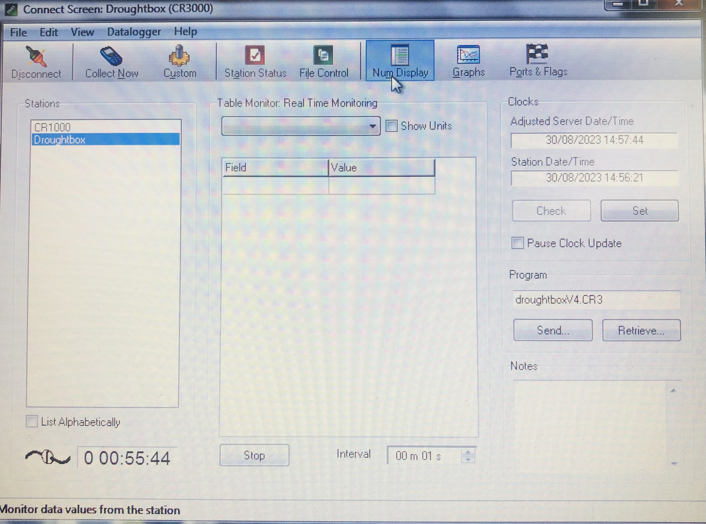
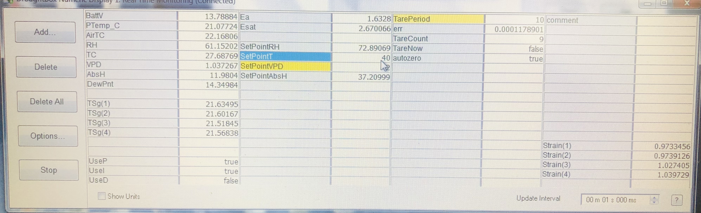

## Connect to the Droughtbox

+ Open LoggerNet v4.1

+ __Initial connect:__ Go to Main -->  and click on Connect

	 

+ __Connect to the Droughtbox:__ Select the Droughtbox and press Connect  

	

## Create a data file

+ __Create data file__:  Go back to the main interface and press the setup bottom  
 

+ __Create a new file__: Select Droughtbox at COM32  --> Go to the Data Files tab --> Select droughtbox --> change the name of the file following the format `YYYY_MM_DATE_OWNER.dat` for example `2023_08_10_erick.dat`

	If you don't change the file path your data file will be stored at `C:\Campbellsci\LoggerNet` 

	To obtain the Network Map as shown in the picture below click on the `View` bottom and select `Standard` 

## Open the numeric display

 + __Open Num Display__: Press Num Display bottom
 

+ This window should appear 

### List of abbreviations in the numerical display 

<table>
  <tr>
   <td><strong>Term</strong>
   </td>
   <td><strong>Definition</strong>
   </td>
   <td><strong>Units</strong>
   </td>
  </tr>
  <tr>
   <td>BattV
   </td>
   <td>Voltage Battery Reading
   </td>
   <td>
   </td>
  </tr>
  <tr>
   <td><em>PTempC</em>
   </td>
   <td>
   </td>
   <td>
   </td>
  </tr>
  <tr>
   <td><em>AirTC</em>
   </td>
   <td>Measured air temperature inside the box 
   </td>
   <td>
   </td>
  </tr>
  <tr>
   <td><em>RH</em>
   </td>
   <td>Measured relative humidity inside the box
   </td>
   <td>
   </td>
  </tr>
  <tr>
   <td><em>TC</em>
   </td>
   <td>
   </td>
   <td>
   </td>
  </tr>
  <tr>
   <td><em>VPD</em>
   </td>
   <td>Measured vapor pressure deficit inside the box
   </td>
   <td>
   </td>
  </tr>
  <tr>
   <td><em>AbsH</em>
   </td>
   <td>Measured absolute humidity inside the box
   </td>
   <td>
   </td>
  </tr>
  <tr>
   <td><em>Strain(1)</em>
   </td>
   <td>Weight measured on strain 1
   </td>
   <td>grams
   </td>
  </tr>
  <tr>
   <td><em>Strain(2)</em>
   </td>
   <td>Weight measured on strain 2
   </td>
   <td>grams
   </td>
  </tr>
  <tr>
   <td><em>Strain(3)</em>
   </td>
   <td>Weight measured on strain 3
   </td>
   <td>grams
   </td>
  </tr>
  <tr>
   <td><em>Strain(4)</em>
   </td>
   <td>Weight measured on strain 4
   </td>
   <td>grams
   </td>
  </tr>
  <tr>
   <td><em>TarePeriod</em>
   </td>
   <td>
   </td>
   <td>
   </td>
  </tr>
  <tr>
   <td><em>err</em>
   </td>
   <td>
   </td>
   <td>
   </td>
  </tr>
  <tr>
   <td><em>TareCount</em>
   </td>
   <td>
   </td>
   <td>
   </td>
  </tr>
  <tr>
   <td><em>TareNow</em>
   </td>
   <td>
   </td>
   <td>
   </td>
  </tr>
  <tr>
   <td><em>autozero</em>
   </td>
   <td>
   </td>
   <td>
   </td>
  </tr>
  <tr>
   <td><em>SetPointRH</em>
   </td>
   <td>Desired Relative Humiity
   </td>
   <td>
   </td>
  </tr>
  <tr>
   <td><em>SetPointT</em>
   </td>
   <td>Desired Temperature
   </td>
   <td>
   </td>
  </tr>
  <tr>
   <td><em>SetPointVPD</em>
   </td>
   <td>Desired vapor pressure deficit
   </td>
   <td>
   </td>
  </tr>
  <tr>
   <td><em>SetPointAbsH</em>
   </td>
   <td>Desired absolute humidity
   </td>
   <td>grams
   </td>
  </tr>
</table>

## Setting up the graphs

+ Go to Graphs tab 

	[insert image]